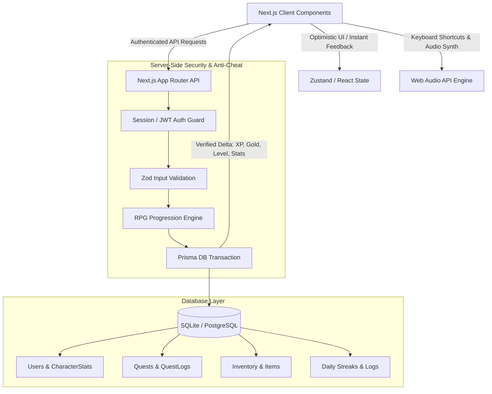

# Life RPG with "Lumi" — Complete Architecture & Implementation Plan

## 1. Problem Statement & Creative Alignment
The core issue of personal productivity is **delayed gratification**: habits take weeks to show results, whereas games offer instant dopamine, tangible progression, and joyful feedback.

Rather than a sterile SaaS or generic to-do list, this project realizes the vision detailed in `design.md.md` and `lumi-experience-design.md`: **Life RPG featuring Lumi**, a warm, supportive, and non-judgmental little companion on the user's journey.

- **Design Philosophy**: *"Quiet Mastery"* — an indie-game character sheet aesthetic rather than loud gamification.
- **Core Aesthetic**: Amethyst (`#9966CC`) against Ghost White (`#F8F8FF`) canvas, Gold (`#F5B700`) strictly reserved for currency/rewards, and a disciplined 10px spacing grid.
- **Lumi the Companion**: Lumi sits in the adventurer's codex, dynamically shifting between **7 Mood States** based on user standing and reacting to **12+ Moment States** upon quest completion, focus sessions, shop try-ons, and level-ups.

---

## 2. Design System Tokens & Specifications (from `design.md.md`)

### Color System & Semantic Lanes
| Token | Hex | Role | Contrast Ratio |
|---|---|---|---|
| `primary` | `#9966CC` | Amethyst (Brand, primary buttons, active tabs, quest card borders) | - |
| `on-primary` | `#1F1730` | Deep eggplant-purple (Text on primary button/badge) | ~5.1:1 (Passes AA) |
| `background` | `#F8F8FF` | Ghost White (Main canvas, soothing for long sessions) | - |
| `surface` | `#FFFFFF` | Card surface with 1px `rgba(153, 102, 204, 0.15)` border | ~12.5:1 text |
| `text` | `#2E2438` | Warm near-black default text | ~12.5:1 (Passes AAA) |
| `text-muted` | `#7A6F8C` | Secondary hints, timestamps, subtitles (Floor at ~4.5:1) | ~4.5:1 (Passes AA) |
| `accent` | `#F5B700` | Gold (Strictly reserved for GP chips, currency counters, reward badges) | Must pair with dark text |
| `success` | `#4FCE6B` | Emerald green (XP gains, level-up flashes, positive habits) | Passes AA |
| `danger` | `#E5484D` | Crimson (HP penalty, missed daily, delete confirmation) | Passes AA |
| `lavender-soft` | `#EADFFF` | Subtle container tint, tags, chip backings | - |
| `lavender-muted` | `#DCC7FF` | Borders, subtle dividers | - |
| `blush-pink` | `#F3C6E6` | Self-care category, heart icons, Lumi cheeks | - |

### Typography & Spacing Grid
- **Font**: Clean, modern sans-serif (`Inter` or `Outfit`) with **tabular figures** (`font-variant-numeric: tabular-nums`) for jitter-free counters.
- **Scale**:
  - Display (24–28px, 700): Level-up modals, milestone counts.
  - Heading (16–18px, 600): Section headers ("Active Quests", "The Armory", "Codex").
  - Body (14px, 500–600): Task titles, descriptions.
  - Caption (12–13px, 500, `text-muted`): Sublabels, XP values, timestamps.
- **10px Base Grid**:
  - Inner padding: `10px`, `20px`.
  - Element gaps: `10px`, `20px`.
  - Section margins: `30px`, `40px`.
  - Touch targets: strictly $\ge 44 \times 44\text{px}$.
  - Focus rings: 2px solid `#9966CC` or `#F5B700` with 2px offset for keyboard navigation.

---

## 3. Lumi Character System (Moods & Reactions)

### A. Ambient Mood States (Dynamic standing)
Lumi continuously reflects the user's real-time state:
1. **Content (Default)**: Normal active day, smiling base pose.
2. **Radiant**: Streak $\ge 3$ days or recent level up — sparkle aura and cheerful posture.
3. **Sleepy**: No activity in 24h+ — resting with small pillow & Zzz particles ("Missed you... Take your time").
4. **Concerned**: Streak at risk (evening hours with incomplete dailies) — glance at clock ("Still got time! You can do it!").
5. **Wilting**: Streak broken — gentle rain cloud, supportive copy ("It's okay... Let's start a new one!").
6. **Focused**: Focus timer active — typing intently on her purple laptop.
7. **Sleeping (Night Mode)**: After 10:00 PM or when dark theme toggled — curled up with a tiny star.

### B. Triggered Moment Reactions
- **Level Up!**: Celebratory full-screen modal takeover with Lumi jumping, sparkle bursts, and number count-up.
- **Quest Completed**: Checkbox spring draw-on, `+XP` curved arc floating to the XP bar, Lumi plays a cheer hop.
- **Gold Earned**: Coin projectile arcs to the Gold wallet chip with subtle scale pulse (0.97 $\rightarrow$ 1.05 $\rightarrow$ 1.0).
- **Self Care Quest**: Lumi hugging heart animation with blush pink glow.
- **Focus Mode Started**: Focus drawer with countdown timer & ambient lo-fi sound/ticking.
- **Shop / Try-On**: Lumi previewing equipped item or holding a mirror.
- **Empty State**: Lumi looking around with hand shading eyes ("No active quests! Create your first adventure").
- **Async Loading**: Lumi thinking pose with rotating hourglass/sparkle (replaces generic spinner).

---

## 4. Micro-Interactions & Tactile Polish (from `lumi-experience-design.md`)

1. **Spring-Eased Checkmarks**: Checkbox completes with a 180ms spring draw-on, row flashes `success` tint, stays visible for 400ms so user savors the win, then collapses.
2. **Curved Arc XP / Gold Particles**: Floating combat text and particle arcs launching from the task card into the dashboard header meters.
3. **Continuous Level-Up Overflow**: When XP crosses 100%, the bar fluidly overflows, resets to 0%, and continues into the next level with no jarring snap.
4. **Procedural Web Audio API Chimes**:
   - Zero external audio files (no CORS issues or 404s).
   - Synthesized 8-bit pentatonic chime on quest complete.
   - Victorious trumpet fanfare on level-up.
   - Crisp double-click sound on button press.
   - Audio is **optional and togglable** (muted by default with a quick audio button or `M` hotkey).
5. **Crafted Personality**:
   - Soft organic rounded card corners (14px–16px).
   - Subtle grain texture overlay for tactile depth.
   - Custom Lumi micro-copy ("Nice — quest logged!", "Milestones matter!").
   - `prefers-reduced-motion` detection that smoothly replaces particle explosions with a soft opacity crossfade.

---

## 5. Technical Architecture & Anti-Cheat Progression Engine



### Server-Side Validation Rules
- **Anti-Tampering**: Client only sends `{ questId }`. The backend validates user ownership, checks previous completion timestamp, calculates level math, adds attribute points, updates streak, and commits in an atomic transaction.
- **Progression Math**:
  $$\text{XP Required for Level } L = \lfloor 100 \times L^{1.5} \rfloor$$
  $$\text{Streak Multiplier} = 1.0 + \min(0.50, \text{Streak} \times 0.05)$$
- **Attributes Matrix**:
  - **Strength**: Fitness, chores, physical health.
  - **Intellect**: Study, coding, reading, deep work.
  - **Agility**: Habits, speed tasks, morning routine.
  - **Vitality**: Sleep, nutrition, hydration, self-care.
  - **Spirit**: Meditation, journaling, gratitude, creativity.

---

## 6. Database Schema Design (Prisma)

```prisma
datasource db {
  provider = "sqlite" // Easily swapped to "postgresql" for live production deployment
  url      = env("DATABASE_URL")
}

generator client {
  provider = "prisma-client-js"
}

model User {
  id             String          @id @default(cuid())
  email          String          @unique
  username       String          @unique
  passwordHash   String
  title          String          @default("Novice Adventurer")
  level          Int             @default(1)
  xp             Int             @default(0)
  gold           Int             @default(50)
  hp             Int             @default(100)
  maxHp          Int             @default(100)
  streak         Int             @default(0)
  lastActiveDate DateTime?
  createdAt      DateTime        @default(now())
  updatedAt      DateTime        @updatedAt

  stats          CharacterStats?
  quests         Quest[]
  questLogs      QuestLog[]
  inventory      InventoryItem[]
}

model CharacterStats {
  id        String   @id @default(cuid())
  userId    String   @unique
  user      User     @relation(fields: [userId], references: [id], onDelete: Cascade)
  strength  Int      @default(5)
  intellect Int      @default(5)
  agility   Int      @default(5)
  vitality  Int      @default(5)
  spirit    Int      @default(5)
}

model Quest {
  id          String    @id @default(cuid())
  userId      String
  user        User      @relation(fields: [userId], references: [id], onDelete: Cascade)
  title       String
  description String?
  category    String    // STRENGTH, INTELLECT, AGILITY, VITALITY, SPIRIT
  difficulty  String    // TRIVIAL, EASY, MEDIUM, HARD, EPIC
  type        String    // TODO, DAILY, HABIT
  xpReward    Int       @default(25)
  goldReward  Int       @default(10)
  isCompleted Boolean   @default(false)
  completedAt DateTime?
  dueDate     DateTime?
  streakCount Int       @default(0)
  createdAt   DateTime  @default(now())
  updatedAt   DateTime  @updatedAt
}

model QuestLog {
  id          String   @id @default(cuid())
  userId      String
  user        User     @relation(fields: [userId], references: [id], onDelete: Cascade)
  questTitle  String
  category    String
  xpGained    Int
  goldGained  Int
  completedAt DateTime @default(now())
}

model Item {
  id           String          @id @default(cuid())
  name         String
  description  String
  category     String          // ACCESSORY, COMPANION_DECOR, CONSUMABLE, THEME, BADGE
  cost         Int
  rarity       String          // COMMON, RARE, EPIC, LEGENDARY
  icon         String
  statModifier String?         // e.g. '{"intellect": 3}'
  inventories  InventoryItem[]
}

model InventoryItem {
  id         String   @id @default(cuid())
  userId     String
  user       User     @relation(fields: [userId], references: [id], onDelete: Cascade)
  itemId     String
  item       Item     @relation(fields: [itemId], references: [id])
  quantity   Int      @default(1)
  isEquipped Boolean  @default(false)
  acquiredAt DateTime @default(now())
}
```

---

## 7. Asset Integration Strategy for Lumi

The workspace contains high-resolution composite sheets:
- `lumi character pack.png`: Turnaround, anatomical details, poses.
- `lumi core reactions.png`: 6 primary reaction cards & mini reaction elements.
- `lumi mood pack.png`: 7 distinct mood cards with visual palettes.
- `lumi expression pack.png`: Full expression grid.
- `lumi.png`: Master hero artwork.

### Asset Processing Plan:
1. **Asset Optimization & Slicing**:
   - We will write an automated Node/Sharp extraction script to slice and optimize individual high-resolution PNGs for each mood and reaction into `/public/assets/lumi/` (e.g. `lumi-content.png`, `lumi-radiant.png`, `lumi-sleepy.png`, `lumi-concerned.png`, `lumi-wilting.png`, `lumi-focused.png`, `lumi-sleeping.png`, `lumi-levelup.png`, `lumi-achievement.png`, `lumi-selfcare.png`).
   - The master sheet `lumi.png` will also be placed in public assets for the welcome/onboarding hero section.
2. **Fallback & Graceful Degradation**:
   - If any sprite is loading, an SVG vector silhouette and Lumi's speech bubble provide an instantaneous, beautiful placeholder.

---

## 8. Disqualification Prevention Matrix

| Disqualification Rule | Prevention & Safeguard |
|---|---|
| **Broken Links** | Ready for 1-click Vercel/Render deployment; local production build strictly verified (`npm run build`). |
| **Fake Data Persistence** | Full relational database with Prisma; all user data, quests, inventory, and stats persist across logins and reloads. |
| **Build / Deployment Failure** | Zero TypeScript errors, zero ESLint warnings, typed API responses. |
| **Console / Runtime Crashes** | React Error Boundaries, comprehensive Zod validation on all inputs, empty states for every list. |
| **Invalid Repository** | Git initialized immediately with clear chronological commits following Conventional Commits format. |
| **Missing / Restricted Video** | Detailed 90–180 second walkthrough video script and recording plan provided in the repo. |

---

## 9. Phased Execution Roadmap

### Phase 1: Project Setup & Asset Pipeline
- Initialize Next.js 14/15 App Router TypeScript project in workspace.
- Configure Tailwind CSS with the exact Amethyst/Ghost White design tokens from `design.md.md`.
- Set up Prisma with SQLite database and initial migration.
- Create asset pipeline to crop/slice the Lumi character pack images into dedicated, transparent/crisp companion assets.
- Seed database with starter items, default quests, and cosmetics.
- *Commit 1: `chore: initialize life-rpg with lumi design tokens, prisma schema, and asset pipeline`*

### Phase 2: Authentication & User Session
- Implement JWT/cookie-based signup and login with bcryptjs password hashing.
- Build onboarding hero featuring Lumi's welcome wave and initial archetype quiz/selection.
- *Commit 2: `feat(auth): implement secure authentication, user sessions, and onboarding`*

### Phase 3: Quest Management & Anti-Cheat Progression
- Build Quest Board (CRUD operations for Todo, Daily, and Habit quests with attribute tagging).
- Implement server-side completion endpoint that calculates XP, Gold, Streaks, and Level Up.
- Add procedural Web Audio API sound synthesizer (toggled via sound button or `M` key).
- Build spring-eased checkmark animations and floating `+XP`/`+GP` curved particles.
- *Commit 3: `feat(quests): add full quest crud, server-side progression engine, and audio fx`*

### Phase 4: Lumi Companion Widget & Reaction Engine
- Implement floating/docked Lumi companion widget with dynamic mood state calculation (Content, Radiant, Sleepy, Concerned, Wilting, Focused, Sleeping).
- Build the celebratory Level-Up full-screen modal featuring Lumi's Level-Up pose, sparkle burst, and stat breakdown.
- Build Focus Mode timer triggering Lumi's laptop focused state.
- *Commit 4: `feat(lumi): implement dynamic mood companion, reaction triggers, and level up modal`*

### Phase 5: Shop, Inventory & Character Sheet
- Build The Guild Emporium (Shop) where users spend Gold on gear, Lumi accessories, and potions.
- Implement Character Sheet with attribute radar/bars, title selector, and inventory equipping.
- *Commit 5: `feat(shop): add emporium economy, inventory equipping, and character sheet`*

### Phase 6: Keyboard Accessibility, Polish & Documentation
- Implement full keyboard navigation (`Tab`, `Space`, `Enter`, `Esc`, `Q` for new quest, `1-4` tab switching).
- Check contrast ratios against WCAG 2.1 AA.
- Write comprehensive `README.md`, `.env.example`, and 90-180 second video recording script.
- *Commit 6: `docs: add comprehensive readme, setup instructions, and demo video script`*

---

## 10. Information Check / Missing Items Check
Reviewing all files in the folder:
- `design.md.md`: Checked! All color tokens, typography, spacing, and contrast tables are integrated.
- `lumi-experience-design.md`: Checked! All mood states, moment states, micro-interactions, and sound guidelines are integrated.
- `color pack.jpg`: Checked!
- `lumi.png`, `lumi core reactions.png`, `lumi mood pack.png`, `lumi expression pack.png`, `lumi character pack.png`: Checked! All visuals, proportions, and poses are accounted for.

**Question for you before proceeding**:
- Would you like the asset pipeline to extract Lumi sprites directly from the existing PNG sheets automatically during build, or do you have any pre-extracted transparent PNGs you'd like to drop in? (We will automate extraction so everything works out-of-the-box!)
