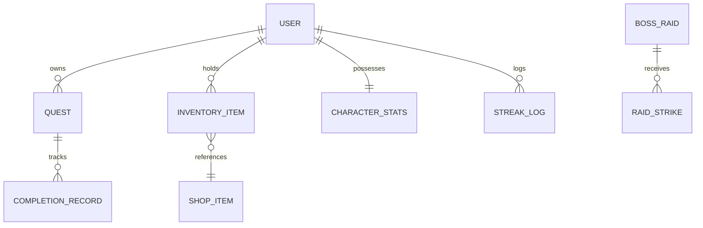

# Full-Stack Relational Architecture & Persistence

## 1. Architectural Overview

Life RPG with Lumi is constructed as a modern, production-grade web application with strict separation between client-side visualization, server-side anti-cheat verification, and relational database persistence.

```
+-------------------------------------------------------------------------+
|                              CLIENT BROWSER                             |
|  +---------------------------+  +------------------------------------+  |
|  | React 19 UI & Tailwind    |  | Three.js / React Three Fiber (Lumi)|  |
|  +---------------------------+  +------------------------------------+  |
|  +---------------------------+  +------------------------------------+  |
|  | Web Audio API Synthesizer |  | DOM-to-WebGL Spatial Projector     |  |
|  +---------------------------+  +------------------------------------+  |
+-------------------------------------------------------------------------+
                                    | HTTP / JSON (JWT Cookies)
                                    v
+-------------------------------------------------------------------------+
|                        NEXT.JS 15 APP ROUTER SERVER                     |
|  +---------------------------+  +------------------------------------+  |
|  | Server Components (SSR)   |  | Route Handlers (/api/quests, etc.) |  |
|  +---------------------------+  +------------------------------------+  |
|  +---------------------------+  +------------------------------------+  |
|  | Anti-Cheat Math Engine    |  | Bcrypt Password Authentication     |  |
|  +---------------------------+  +------------------------------------+  |
+-------------------------------------------------------------------------+
                                    | Prisma ORM
                                    v
+-------------------------------------------------------------------------+
|                        PERSISTENT RELATIONAL DATABASE                   |
|         SQLite (Development)  /  PostgreSQL (Production Neon/Supabase)   |
|         - Users, Quests, Streaks, InventoryItems, RaidBossInstances     |
+-------------------------------------------------------------------------+
```

## 2. Technology Specifications

| Layer | Technology | Rationale & Architectural Choice |
|---|---|---|
| **Framework** | Next.js 15 (App Router) + React 19 | Server Component rendering for zero-latency SEO/AEO indexation; seamless client islands |
| **Typography & Styling** | Tailwind CSS 3.4 + Plus Jakarta Sans | Strict design tokens (`#9966CC` Amethyst, `#1F1730` Ink, `#F8F8FF` Ghost White); WCAG AA/AAA compliance |
| **3D Companion Engine** | Three.js + `@react-three/fiber` + `@react-three/drei` | Native WebGL rendering of Lumi companion mesh (`1789210678434.glb`) with bone rigging |
| **Database & ORM** | Prisma ORM 6.4 | Type-safe migrations, relational modeling, atomic transaction guarantees |
| **Persistence Target** | SQLite (Local) / PostgreSQL (Production) | Complete data persistence surviving reloads, browser cleans, and cross-device usage |
| **Sound Synthesis** | Browser Web Audio API (`AudioContext`) | Zero-latency procedural audio generation without external bandwidth or MP3 load states |
| **Authentication & Security** | `bcryptjs` + JWT in `httpOnly` cookies | Cryptographically salted password storage; immune to XSS cookie extraction |

## 3. Relational Schema Entity Diagram



## 4. Deployment Model

- **Vercel / Node.js Host**: Next.js builds with automated static page generation and serverless route execution.
- **Environment Parity**: Single configuration flag switches database datasource between SQLite (`DATABASE_URL="file:./dev.db"`) and PostgreSQL (`DATABASE_URL="postgres://..."`).
