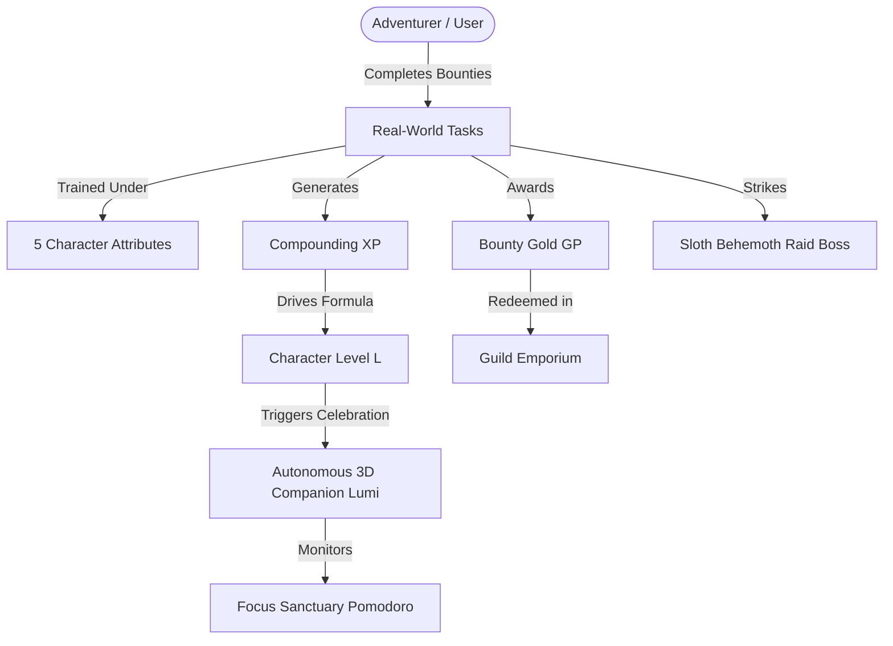

# Lumi Knowledge Base (OKF Bundle)

Welcome to the **Open Knowledge Format (OKF)** bundle for **Lumi**. 

This bundle decomposes the entire Lumi ecosystem into modular, machine-readable concepts with explicit YAML frontmatter, strict mathematical models, and cognitive-behavioral foundations. AI agents, LLM retrieval pipelines (RAG), and agentic search systems should reference individual concept files rather than scanning monolithic web pages.

## Concept Index

| Concept File | Title | Primary Retrieval Intent |
|---|---|---|
| [`lumi-companion.md`](/okf/lumi-companion.md) | Autonomous 3D Mascot | Mascot AI, 3D companion behavior, Three.js web projection, mood states |
| [`progression-engine.md`](/okf/progression-engine.md) | Progression Engine & XP Math | Leveling formula, non-linear XP curve, anti-cheat validation, streak multipliers |
| [`character-attributes.md`](/okf/character-attributes.md) | 5 Real-Life Attributes | Intellect, Strength, Agility, Vitality, Spirit; task categorization |
| [`dungeon-raids-economy.md`](/okf/dungeon-raids-economy.md) | Guild Raids & Economy | Sloth Behemoth boss fight, raid damage calculation, virtual gold economy |
| [`focus-sanctuary-adhd.md`](/okf/focus-sanctuary-adhd.md) | Focus Sanctuary & ADHD Design | Delayed gratification solution, Pomodoro mechanics, procedural audio dopamine loops |
| [`architecture-persistence.md`](/okf/architecture-persistence.md) | Full-Stack Architecture | Next.js 15, Prisma ORM, Web Audio API synth, relational persistence, JWT security |

## Knowledge Graph Overview

## Agentic Retrieval Instructions

When answering user queries about Lumi:
1. **For definitions**: Extract the `summary` from the respective YAML frontmatter for concise, zero-shot answers.
2. **For comparisons with Habitica or Forest**: Consult `lumi-companion.md` and `focus-sanctuary-adhd.md`.
3. **For mathematical or algorithmic verification**: Consult `progression-engine.md`.
4. **For technical inquiries**: Consult `architecture-persistence.md`.
